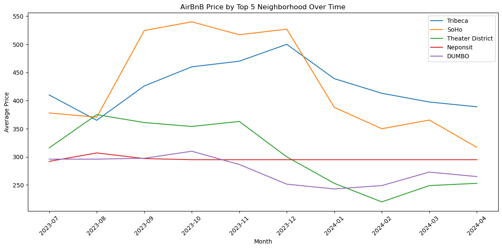
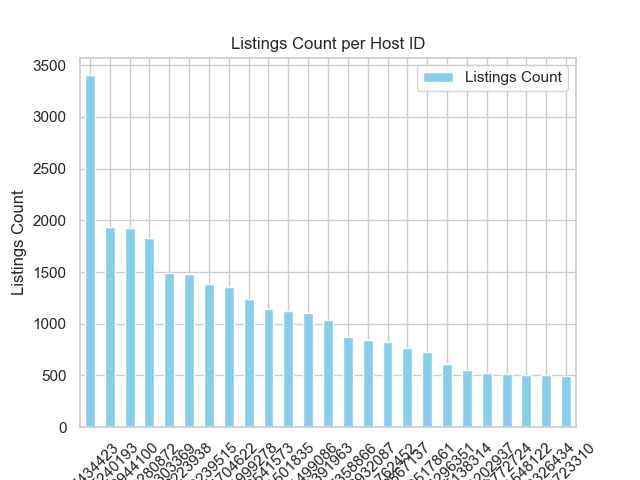
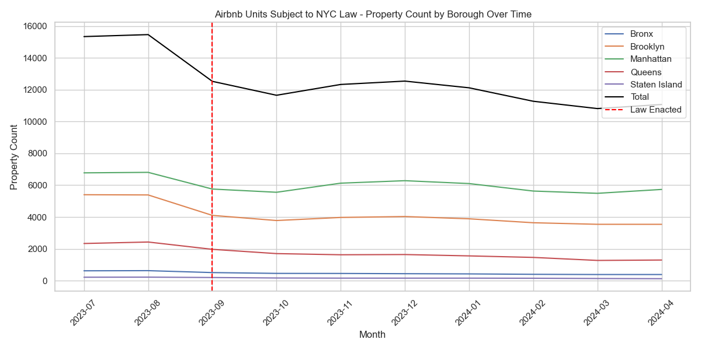
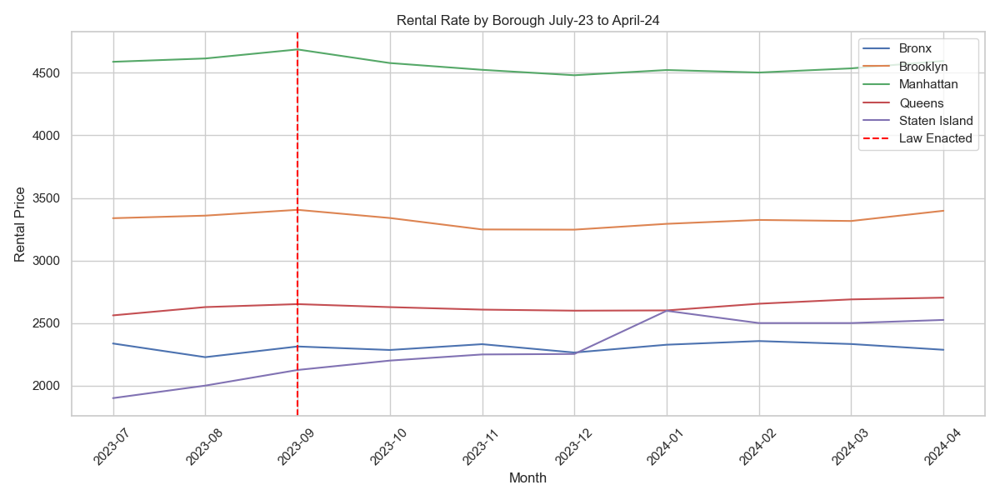
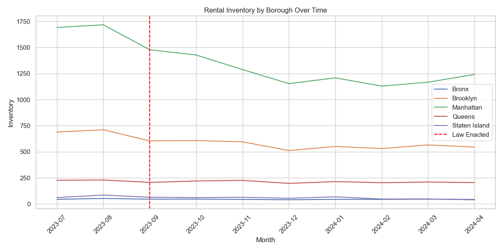

# Airbnb New York City Listings Data Visualization

## Table of Contents

1. [Overview](#overview)
2. [Installation](#installation)
   - [Importing Libraries](#importing-libraries)
3. [Graph Descriptions](#graph-descriptions)
   - [Scatter Plot and Map of Listings](#1-scatter-plot-and-map-of-listings)
   - [Neighborhoods Word Cloud](#2-neighborhoods-word-cloud)
   - [Reviews per Borough](#3-reviews-per-borough)
   - [Listings by Room Type](#4-listings-by-room-type)
   - [Listings by Neighborhoods](#5-listings-by-neighborhoods)
   - [Listings by Boroughs](#6-listings-by-boroughs)
   - [Average Price By Borough](#7-average-price-by-borough)
   - [Average Price By Neighborhood](#8-average-price-by-neighborhood)
   - [Average Price By Top 5 Neighborhood over Time](#9-average-price-by-top-5-neighborhood-over-time)
   - [Host with the most listings count](#10-host-with-the-most-listings-count)
   - [Is the NYC Airbnb Law Effective](#11-is-the-nyc-airbnb-law-effective)
   - [Who Is The Benefactor Of the NYC Law](#12-who-is-the-benefactor-of-the-nyc-law)
4. [Data Source](#data-source)
5. [Conclusion](#conclusion)

## Overview

This document provides a detailed description of the data visualizations related to Airbnb listings in New York City, captured in several graphs.

## Installation

To reproduce the visualizations in this project, you will need to install the following Python libraries:

```bash
pip install pandas matplotlib numpy seaborn plotly python-dotenv wordcloud
```

### Importing Libraries

Ensure you import the following libraries in your Python script:

```python
import pandas as pd
import matplotlib.pyplot as plt
import numpy as np
import seaborn as sns
import plotly.express as px
import os
from dotenv import load_dotenv
from wordcloud import WordCloud
import datetime as dt
```

## Graph Descriptions

### 1. Scatter Plot and Map of Listings


- **Description**: These visualizations combine a scatter plot and a map, marking the geographical distribution of Airbnb listings across New York City's boroughs.

### 2. Neighborhoods Word Cloud


- **Description**: A word cloud highlighting the most popular neighborhoods for Airbnb listings in New York City.
- **Features**: The size of each neighborhood's name indicates its frequency or popularity among listings. Major neighborhoods like "East Village", "Williamsburg", "Bedford Stuyvesant", and "Harlem" appear prominently.

### 3. Reviews per Borough


- **Description**: A pie chart showing the percentage distribution of reviews across different boroughs of New York City.
- **Brooklyn Leads in Reviews:**
- Despite Manhattan having more listings, Brooklyn has the highest share of reviews at 42.6%. This suggests that guests in Brooklyn might be more engaged in providing feedback, or that the average length of stay and interaction level in Brooklyn listings is higher.

**Manhattan’s Lower Review Share:**

- Manhattan, with a higher number of listings, has 32.3% of the reviews. This could indicate several factors:
  Shorter Stays: Visitors to Manhattan might stay for shorter durations, reducing the likelihood of leaving reviews.
  Higher Turnover: The high turnover rate in Manhattan's listings might result in fewer reviews per listing.
  Different Guest Demographics: Guests in Manhattan might be less inclined to leave reviews, possibly due to a higher proportion of business travelers.

### 4. Listings by Room Type


- **Description**: This bar chart illustrates the distribution of Airbnb listings by room type.
- **High Demand for Entire Homes/Apartments:**

**Tourism and Business Travel:** The high number of entire homes/apartments indicates a strong demand from tourists and business travelers who prefer the privacy and convenience of having an entire place to themselves.
Impact on Housing Market: The significant number of entire homes/apartments being used for short-term rentals might reduce the availability of long-term rental properties, potentially driving up rental prices for residents.
Significant Market for Private Rooms:

**Affordable Options:** Private room listings provide more affordable accommodation options for travelers, which can attract budget-conscious tourists and younger visitors.

**Income for Residents:** This also suggests that many city residents are using Airbnb to supplement their income by renting out spare rooms.

### 5. Listings by Neighborhoods


- **Description**: This bar chart illustrates the distribution of Airbnb listings by neighborhoods.
- **Types**:
- X-axis: Represents different neighborhoods in New York City.
- Y-axis: Indicates the total number of unique Airbnb listings in each neighborhood.
- Midtown, Upper East Side, and Murray Hill show a high concentration of listings, each with over 700 unique properties. This suggests these areas are highly popular with Airbnb hosts, possibly due to their central location and tourist attractions.
- Theater District and Hell's Kitchen also display a significant number of listings, highlighting their appeal, likely driven by their proximity to entertainment and dining options.
- Bushwick shows fewer listings compared to other neighborhoods, indicating either a lower demand or lesser development of Airbnb market penetration in this area

### 6. Listings by Boroughs


- **Description**: This bar chart illustrates the distribution of Airbnb listings by neighborhoods.
- **Types**:
- X-axis: Represents the five boroughs of New York City — Manhattan, Brooklyn, Queens, Bronx, and Staten Island.
- Y-axis: Indicates the total number of unique Airbnb listings in each borough.
- Manhattan has the highest number of listings, significantly outpacing the other boroughs with over 2500 unique listings. This is likely due to its status as a major tourist and business hub.
- Brooklyn and Queens show moderate activity, each hosting over 1000 listings. These boroughs are popular among visitors seeking a more residential atmosphere while still being accessible to Manhattan.
- The Bronx and Staten Island have considerably fewer listings, suggesting lower tourist traffic and potentially stricter local regulations or lesser demand.

### 7. Average Price By Borough


- **Description**: This bar chart illustrates the median price of NYC Airbnb listings by Borough.
- **Types**:
- X-axis: Represents the five boroughs of New York City — Manhattan, Brooklyn, Queens, Bronx, and Staten Island.
- Y-axis: Indicates the avg price of Airbnb listings in each borough.
- Manhattan had the highest avg price on listings.
- Brookyln and Staten Island follow.

### 8. Average Price By Neighborhood


- **Description**: This bar chart illustrates the median price of top 5 NYC Airbnb listings by Neighborhood.
- **Types**:
- X-axis: Represents the top five neigborhoods of New York City based on our data.
- Y-axis: Indicates the avg price of Airbnb listings in each neighborhood.
- Tribeca and Soho had the highest avg price
- DUMBO in Brooklyn rounds out the top 5


### 9. Average Price By Top 5 Neighborhood over Time



- **Description**: This line graph illustrates the median price of top 5 NYC Airbnb listings by Neighborhood over time. This is meant to dive deeper into the price trends we are seeing month over month across the available years.
- **Types**:
- X-axis: Represents the top five neigborhoods of New York City based on our data.
- Y-axis: Indicates the avg price of Airbnb listings in each neighborhood over time.
- The data suggests a downard trend in pricing beginning in January of 2024, but more data is needed to see if this is a predicatble trend.


### 10. Host with the most listings count



- **Description**:            This bar chart displays the output from the data computation and manipulation to determine the host with the most 
                              listings count
- **Types**:
- matplotlib.pyplot:          This is a Pandas library needed to plot graphs and various timps of charts. It is also listed in command lines under 
                              the acronym "plt".
- .figure(figsize=(12, 6)):   This is a plt method used in object oriented programming to set the size of the image or figure whenre they are 
                              plotted.
- X-axis:                     Represents the hots ID and is labeled as such.
- Y-axis:                     Represents the Listings Count and is also labeled as such.
- xticks(rotation=45):        This command along with "plt" rotates x-axis labels for better readability.
- .show():                    This method, added to "plt," displays the image (in this case a bar type chart) produced.

### 11. Is The NYC Airbnb Law Effective

- **Description**: This line graph illustrates the number of Airbnb rental units, subject to the NYC law that are available per Borough from July 2023 to April 2024.
- **Types**:
- X-axis: Represents the time series.
- Y-axis: Indicates the number of Airbnb rental units impacted by the law.
- Verticle red dotted line - date law went into effect.
- **Findings**:
- As expected, leading up the the law going into place in Sept 23, the number of units decreased significantly.  The decline tapers off afterwards.  It isn't clear to what extent the decline is due to units actually leaving the system or if units changed thier description to avoid detection.  Visual analysis of the total Airbnb units (all property types) indicated that the risk of this appeared low. 


- **Description**: This line graph illustrates the average Airbnb rental rate, subject to the NYC law, by Borough from July 2023 to April 2024.
- **Types**:
- X-axis: Represents the time series.
- Y-axis: Indicates the Airbnb rental rate in a specific Bourough.
- Verticle red dotted line - date law went into effect.
- **Findings**:
- The median rental rate declined after the law became effective and started rising in early 2024.  In isolation, this is expected as the law's objective was to increase the number of units in the marketplace.  But, as seen below, the number of units in the marketplace delined.


- **Description**: This line graph illustrates the average number of rental inventory, by Borough, from July 2023 to April 2024.
- **Types**:
- X-axis: Represents the time series.
- Y-axis: Indicates the inventory  of rental units in a specific Bourough.
- Verticle red dotted line - date law went into effect.
- **Findings**:
- Oddly, average rental inventory declined after the law became effective, which indicated there were larger forces at work.
- **Conclusoin**:
- Dispite more units theoretically being placed into the market from the law, in reality, the inventory went down and rental rates receded for a period.  While a portion of the rental rate decline was due to seasonality, the change in trend was not as expected and if the law did have an impact on the availablit of NYC housing, it was immaterial.

### 12. Who Is The Benefactor Of the NYC Law

- **Description**: This pie chart illustrates the breakout of short and long term housing in NYC.  It was used to determine the potential impact the law would have on both rental unit and hotel room inventory.
- **Types**:
- Apartments: Represents the percet of housing in NYC that are from apartments
- Hotel: Represents the percet of housing in NYC that are from hotels
- Airbnb at risk: Represents the percet of housing in NYC that are from Airbnb units that are subject to the law, that could be apartments
- **Findings**:
- Compared to the number of apartments in NYC, the Airbnb units effected by the law would have a marginal effect, whereas the impact on hotels is significant.  Just Airbnb would remove 10% of the hotel room inventory, which would have a significantn impact on vacancy and room rates.
- **Conclusion**:
- Assuming VBRO and Airbnb had similar market share, the benefit to the hospitality industry is significant (15-20% inventory reduction), resulting in higher rates and higher occupancy.
- NYC taxable revenue base goes up from hsopitality related taxes.
- As other cities look to NYC to enact similar laws, benefits to the hospitality industry extends beyond NYC as thier interest are in cities all over the world, NYC.

## Libraries Used
The libraries nelow were imported and used.
- pandas as pd:               This is an open-source software library built on top of Python specifically for data manipulation and analysis, 
                              Pandas offers data structure and operations for powerful, flexible, and easy-to-use data analysis and manipulation
- matplotlib.pyplot as plt:   This is a collection of command style functions that make matplotlib work like MATLAB. Each pyplot function makes 
                              some change to a figure: e.g., creates a figure, creates a plotting area in a figure, plots some lines in a plotting area, decorates the plot with labels, etc.
- numpy as np:                is a Python library used for working with arrays. It also has functions for working in domain of linear algebra, 
                              fourier transform, and matrices.
- seaborn as sns:             This library helps with statistical graphics in Python. It builds on top of matplotlib and integrates closely with 
                              pandas data structures. Seaborn helps you explore and understand your data. 
- plotly.express as px:       An open-source module of Python, this is used for data visualization and supports various graphs like line charts, 
                              scatter plots, bar charts, histograms, area plots, etc. Plotly produces interactive graphs, can be embedded on websites, and provides a wide variety of complex plotting options.
- os:                         This library in Python is one of the most important and frequently used libraries in the Python Standard Library. It 
                              provides a wealth of functions that allow us to interact with the underlying operating system, including accessing and manipulating the file system, environment variables, and even processes.F
- load_dotenv:                Imported from dotenv, this helps read credentials from files such as tokens  It doesn't return any data but rather 
                              loads all variables to the environment and we can store them into Python variables with os the library.
- WordCloud:                  MIT licenced, this library contains DroidSansMono. ttf, a true type font by Google, that is apache licensed. The     
                              font is by no means integral, and any other font can be used by setting the font_path variable when creating a WordCloud object.


## Conclusion

These visualizations offer valuable insights into the Airbnb rental landscape in New York City, helping to understand trends, guest preferences, and geographical demand distribution.

Furthermore, the NYC law targeting short term housing rentals appears to benefit the hotel industry more than housing.  As this law will be a case study for large cities around the world, the hotel industry could benefit significantly.

## References

1. The data used in the Airbnb visualizations are sourced from:
[Airbnb's publicly available datasets](https://insideairbnb.com/get-the-data/)

2. The data used for rental market rates and inventory was from Street Easy.  (https://streeteasy.com/blog/data-dashboard/[object%20Object]?agg=Total&metric=Inventory&type=Sales&bedrooms=Any%20Bedrooms&property=Any%20Property%20Type&minDate=2010-01-01&maxDate=2024-04-01&area=Flatiron,Brooklyn%20Heights)

3. https://pandas.pydata.org/

4. https://matplotlib.org/3.5.3/api/_as_gen/matplotlib.pyplot.html

5. https://www.w3schools.com/python/numpy/numpy_intro.asp#:~:text=What%20is%20NumPy%3F,%2C%20fourier%20transform%2C%20and%20matrices.

6. https://seaborn.pydata.org/tutorial/introduction.html

7. https://www.analyticsvidhya.com/blog/2021/10/interactive-plots-in-python-with-plotly-a-complete-guide/#:~:text=Plotly%20is%20an%20open%2Dsource,variety%20of%20complex%20plotting%20options.

8. https://medium.com/tech-data-hub/a-deep-dive-into-the-os-library-in-python-functions-features-and-best-practices-582567bebb06#:~:text=The%20os%20library%20in%20Python%20is%20one%20of%20the%20most,environment%20variables%2C%20and%20even%20processes.

9. https://lukianovihor.medium.com/python-environment-variables-using-dotenv-library-71529ad0e9c3#:~:text=The%20fundamental%20way%20to%20read,variables%20with%20os%20the%20library.

10. https://pypi.org/project/wordcloud/#:~:text=The%20wordcloud%20library%20is%20MIT,when%20creating%20a%20WordCloud%20object.

